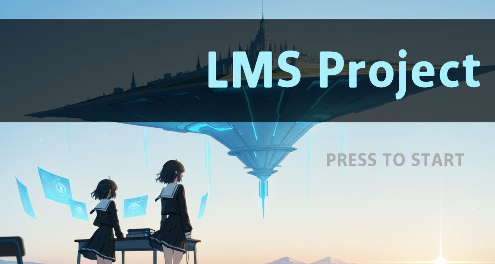

# SingleLMSProject


# 사용 툴
- Unity 6000.2.10f1
- ComfyUI [※ 프로그램에 사용되는 이미지는 AI로 생성한 이미지입니다]


# 사용 에셋
- [DOTween](https://assetstore.unity.com/packages/tools/animation/dotween-hotween-v2-27676)
- [GUI Pro - Survival Clean](https://assetstore.unity.com/packages/p/gui-pro-survival-clean-194741)

# 폰트 
- 서울 폰트


# 구현 과정에서 생기는 유의사항.

- CoroutineHandler 사용법
```c 
	CoroutineHandler.Instance.StartRoutine("Logo", ShowStarting());
	CoroutineHandler.Instance.StopRoutine("Logo");
```
	
- WaitForSecondsCache
```c 
	yield return WaitForSecondsCache.Get(showTime);
```


# History

## 1일차 구현 목적 - 메인 타이틀 구현하기
- TitleScene 구성하기
	- UIManager : FadeIn/Out
	- CoroutineHandler : Coroutine 관리하기
	- Library : Caching 관리하기
	
- Namespace
	- LMS.Libray : Static 함수 및 기능 모음집
		- Cache : Coroutine에 사용되는 new 캐싱
	- LMS.Management : 싱글톤으로 구성된 관리 매니저 모음집
		- Singleton : 부모 싱글톤
		- UIManager : UI 관리 싱글톤
		- CoroutineHandler : Coroutine 관리 싱글톤
	- LMS.Title : 타이틀 화면에서 사용되는 기능 모음집
		- LMS_LogoManager : 로고를 관리하는 매니저
		- LMS_PromotionManager : 프로모션을 관리하는 매니저
			- interface - ILogo : 로고 개별 객체 (추후 아이디어 발현시 구현 예정)
			- interface - IntroVideo : 프로모션 개별 객체, mp4 파일 비디오 출력 (추후 아이디어 발션시 추가 구현 예정)
		- LMS_MainManager : 메인 타이틀을 관리하는 매니저
	- LMS.UI : UI의 기능 관리 및, UI 루틴 모음집
		- MainTitle : TitleScene의 Main을 담당하는 스크립트

## 2일차 구현 목적 - 레벨링 디자인 구현하기